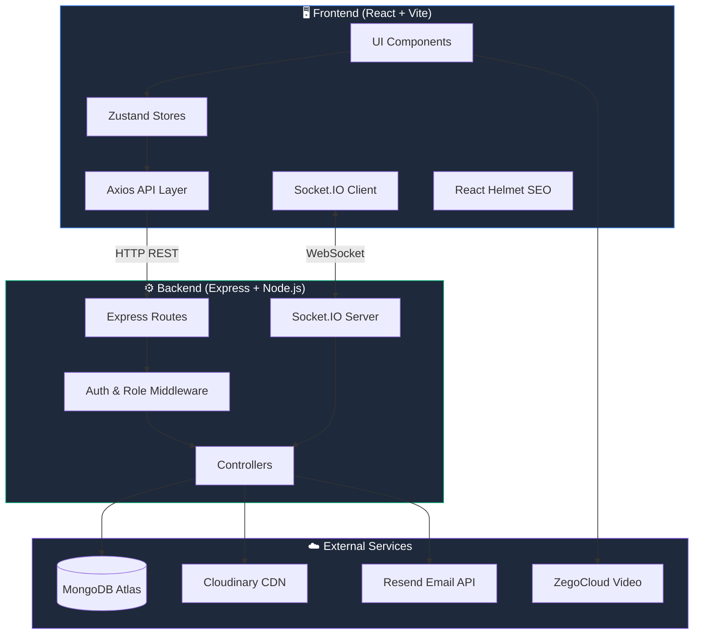
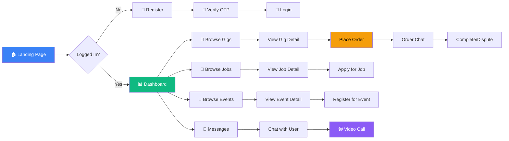
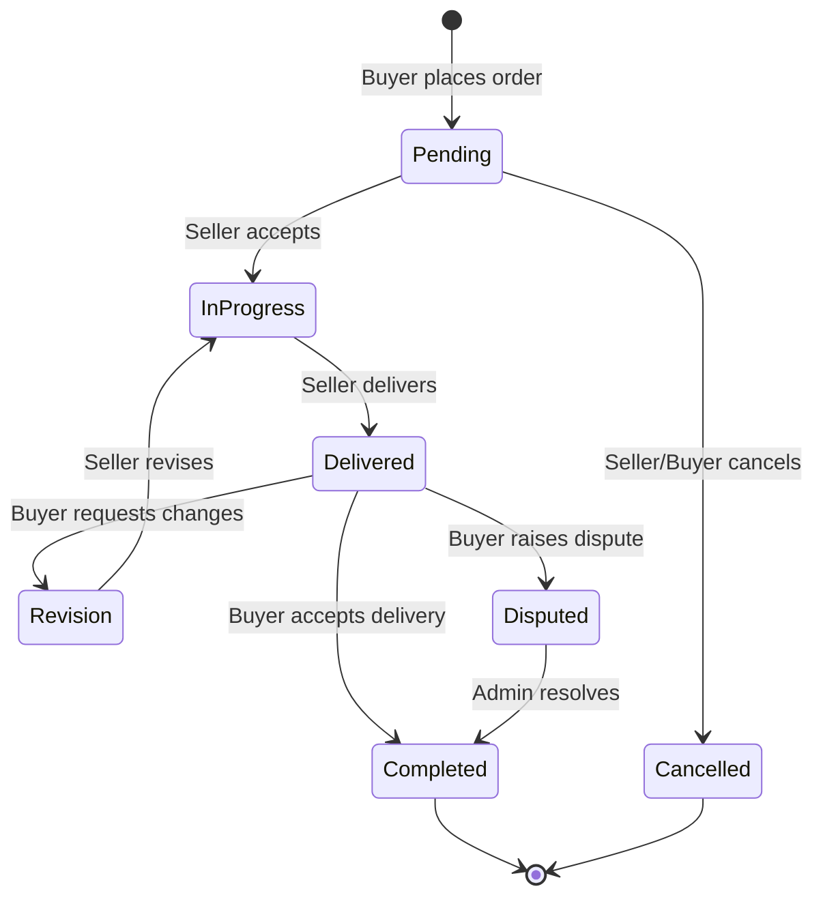

<div align="center">

# 🎓 Unilancer

### Campus Freelance Marketplace for Students & Alumni

[](https://unilancer.online)
[](https://github.com/kundansingh333/Unilancer)
[](LICENSE)

**Unilancer** is a full-stack freelance marketplace built exclusively for university students, alumni, and faculty. Post gigs, find jobs, attend campus events, and manage orders — all in one platform.

[🚀 Live Demo](https://unilancer.online) · [🐛 Report Bug](https://github.com/kundansingh333/Unilancer/issues) · [💡 Request Feature](https://github.com/kundansingh333/Unilancer/issues)

</div>

---

## 📸 Screenshots

> Visit [https://unilancer.online](https://unilancer.online) for a live preview.

---

## ✨ Features

### 👤 Authentication & Roles
- Email-based registration with OTP verification
- Role-based access: **Student**, **Alumni**, **Faculty**, **Admin**
- JWT-based authentication with secure password hashing
- Forgot password & reset password flow

### 💼 Gigs Marketplace
- Create, browse, and order freelance gigs
- Category filtering, search, price range, rating filters
- Review system with helpful votes
- Order management with real-time chat

### 🏢 Jobs Board
- Post and apply for internships, full-time, part-time, and contract jobs
- Bookmark jobs, track applications
- Employer dashboard to manage applicants

### 🎪 Events System
- Create and manage hackathons, workshops, tech talks, seminars
- Event registration with attendance tracking
- Featured events showcase
- Organizer dashboard

### 💬 Real-Time Messaging
- 1-on-1 chat with typing indicators
- Order-specific chat rooms
- Online user status
- Emoji picker support

### 📹 Video & Voice Calls
- WebRTC-based video/voice calls via ZegoCloud
- Call signaling through Socket.IO
- Incoming call notifications

### 🔔 Notifications
- Real-time notifications for orders, messages, events
- Mark as read functionality

### 🛡️ Admin Panel
- Dashboard with platform statistics
- Approve/reject gigs, jobs, events, and users
- Manage disputed orders
- View and manage deleted users

### 📈 SEO Optimized
- JSON-LD Schema Markup (Organization, WebSite, BreadcrumbList)
- Open Graph & Twitter Card meta tags
- Dynamic per-page titles and descriptions
- Sitemap and robots.txt

---

## 🛠️ Tech Stack

| Layer | Technology |
|-------|-----------|
| **Frontend** | React 19, Vite 7, TailwindCSS 4 |
| **State Management** | Zustand |
| **Routing** | React Router DOM v7 |
| **Backend** | Express 5, Node.js |
| **Database** | MongoDB Atlas (Mongoose 8) |
| **Real-Time** | Socket.IO |
| **Video Calls** | ZegoCloud UIKit |
| **File Uploads** | Cloudinary + Multer |
| **Email** | Resend API |
| **Auth** | JWT + bcryptjs |
| **SEO** | react-helmet-async |
| **Deployment** | Vercel (Frontend), Railway/Render (Backend) |

---

## 📂 Project Structure

```
Unilancer/
├── client/                     # React Frontend
│   ├── public/
│   │   ├── metaLOGO.svg       # Favicon
│   │   ├── og-banner.png      # Social media preview image
│   │   ├── sitemap.xml        # SEO sitemap
│   │   └── robots.txt         # Crawler rules
│   ├── src/
│   │   ├── api/               # Axios API layer
│   │   │   ├── client.js      # Axios instance with auth interceptor
│   │   │   ├── gigsApi.js     # Gig endpoints
│   │   │   ├── jobsApi.js     # Job endpoints
│   │   │   ├── ordersApi.js   # Order endpoints
│   │   │   ├── messageApi.js  # Message endpoints
│   │   │   └── ...
│   │   ├── components/
│   │   │   ├── layout/        # Navbar, Footer, HeroSection
│   │   │   ├── gigs/          # GigCard, GigForm, GigDetailPage
│   │   │   ├── common/        # IncomingCallModal, etc.
│   │   │   ├── SEO.jsx        # Reusable SEO meta component
│   │   │   ├── Breadcrumbs.jsx # Breadcrumb navigation
│   │   │   └── ...
│   │   ├── pages/
│   │   │   ├── auth/          # Login, Register, ForgotPassword
│   │   │   ├── jobs/          # JobList, JobDetail, CreateJob
│   │   │   ├── events/        # EventList, EventDetail, CreateEvent
│   │   │   ├── orders/        # OrdersList, OrderDetail
│   │   │   ├── message/       # Conversations, Chat, CallRoom
│   │   │   ├── admin/         # Admin dashboard & approval pages
│   │   │   └── ...
│   │   ├── store/             # Zustand state stores
│   │   ├── hooks/             # Custom React hooks
│   │   ├── socket/            # Socket.IO client setup
│   │   ├── App.jsx            # Route definitions
│   │   └── main.jsx           # Entry point with HelmetProvider
│   ├── index.html             # SEO-optimized HTML shell
│   ├── vite.config.js
│   ├── vercel.json            # Vercel rewrite rules
│   └── package.json
│
├── backend/                    # Express Backend
│   ├── config/
│   │   ├── db.js              # MongoDB connection
│   │   └── cloudinary.js      # Cloudinary config
│   ├── controllers/
│   │   ├── authController.js  # Register, login, OTP, password reset
│   │   ├── gigController.js   # CRUD gigs, reviews
│   │   ├── jobController.js   # CRUD jobs, applications
│   │   ├── eventController.js # CRUD events, registrations
│   │   ├── orderController.js # Order lifecycle management
│   │   ├── messageController.js # Chat & conversations
│   │   ├── adminController.js # Admin operations
│   │   └── ...
│   ├── models/
│   │   ├── User.js            # User schema (student/alumni/faculty/admin)
│   │   ├── Gig.js             # Gig schema with reviews
│   │   ├── Job.js             # Job schema with applications
│   │   ├── Event.js           # Event schema
│   │   ├── Order.js           # Order schema with status flow
│   │   ├── Message.js         # Message schema
│   │   ├── Conversation.js    # Conversation schema
│   │   ├── Notification.js    # Notification schema
│   │   └── DeletedUser.js     # Soft-deleted users
│   ├── middleware/
│   │   ├── auth.js            # JWT verification
│   │   ├── roleAuth.js        # Role-based access control
│   │   ├── upload.js          # Multer file upload
│   │   └── errorHandler.js    # Global error handler
│   ├── routes/                # Express route definitions
│   ├── services/
│   │   └── notificationService.js
│   ├── server.js              # Entry point (Express + Socket.IO)
│   └── package.json
│
└── README.md
```

---

## 🏗️ Architecture Flow



### 🔄 User Flow



### 📦 Order Lifecycle



---

## 🚀 Getting Started

### Prerequisites

- **Node.js** v18+ ([Download](https://nodejs.org/))
- **MongoDB** Atlas account or local MongoDB ([Setup](https://www.mongodb.com/atlas))
- **Cloudinary** account for image uploads ([Sign Up](https://cloudinary.com/))
- **Resend** account for emails ([Sign Up](https://resend.com/))
- **Git** ([Download](https://git-scm.com/))

### 1. Clone the Repository

```bash
git clone https://github.com/kundansingh333/Unilancer.git
cd Unilancer
```

### 2. Setup Backend

```bash
# Navigate to backend
cd backend

# Install dependencies
npm install

# Create environment file
cp .env.example .env   # Or create .env manually
```

Create a `.env` file in `backend/` with these variables:

```env
# Server
PORT=5001
NODE_ENV=development

# Database
MONGO_URI=mongodb+srv://<username>:<password>@cluster0.xxxxx.mongodb.net/<dbname>

# JWT Secret (use a strong random string)
JWT_SECRET=your_super_secret_jwt_key_here

# Resend API (for sending emails)
RESEND_API_KEY=re_xxxxxxxxxxxxxxxxxxxx

# Frontend URL (for CORS)
FRONTEND_URL=http://localhost:5173

# Cloudinary (for image/file uploads)
CLOUDINARY_NAME=your_cloud_name
CLOUDINARY_KEY=your_api_key
CLOUDINARY_SECRET=your_api_secret
```

```bash
# Start the backend server
npm run dev
```

The backend will start at `http://localhost:5001`.

### 3. Setup Frontend

```bash
# Navigate to frontend (from project root)
cd client

# Install dependencies
npm install

# Create environment file
```

Create a `.env` file in `client/` with:

```env
VITE_API_URL=http://localhost:5001/api

# ZegoCloud (for video calls - optional)
VITE_ZEGO_APP_ID=your_zego_app_id
VITE_ZEGO_SERVER_SECRET=your_zego_server_secret
```

```bash
# Start the development server
npm run dev
```

The frontend will start at `http://localhost:5173`.

### 4. Open in Browser

Visit **[http://localhost:5173](http://localhost:5173)** — you should see the Unilancer homepage! 🎉

---

## 🔧 Environment Variables Reference

### Backend (`backend/.env`)

| Variable | Description | Required |
|----------|-------------|:--------:|
| `PORT` | Server port (default: 5001) | ✅ |
| `NODE_ENV` | `development` or `production` | ✅ |
| `MONGO_URI` | MongoDB connection string | ✅ |
| `JWT_SECRET` | Secret key for JWT tokens | ✅ |
| `RESEND_API_KEY` | Resend.com API key for emails | ✅ |
| `FRONTEND_URL` | Frontend URL for CORS | ✅ |
| `CLOUDINARY_NAME` | Cloudinary cloud name | ✅ |
| `CLOUDINARY_KEY` | Cloudinary API key | ✅ |
| `CLOUDINARY_SECRET` | Cloudinary API secret | ✅ |

### Frontend (`client/.env`)

| Variable | Description | Required |
|----------|-------------|:--------:|
| `VITE_API_URL` | Backend API base URL | ✅ |
| `VITE_ZEGO_APP_ID` | ZegoCloud App ID (video calls) | Optional |
| `VITE_ZEGO_SERVER_SECRET` | ZegoCloud Server Secret | Optional |

---

## 📡 API Endpoints

### Auth
| Method | Endpoint | Description |
|--------|----------|-------------|
| POST | `/api/auth/register` | Register new user |
| POST | `/api/auth/verify-otp` | Verify email OTP |
| POST | `/api/auth/login` | Login |
| POST | `/api/auth/forgot-password` | Send reset email |
| POST | `/api/auth/reset-password` | Reset password |

### Gigs
| Method | Endpoint | Description |
|--------|----------|-------------|
| GET | `/api/gigs` | List all gigs (with filters) |
| GET | `/api/gigs/:id` | Get gig details |
| POST | `/api/gigs` | Create a gig |
| POST | `/api/gigs/:id/reviews` | Add a review |

### Jobs
| Method | Endpoint | Description |
|--------|----------|-------------|
| GET | `/api/jobs` | List all jobs |
| GET | `/api/jobs/:id` | Get job details |
| POST | `/api/jobs` | Post a job |
| POST | `/api/jobs/:id/apply` | Apply for a job |

### Events
| Method | Endpoint | Description |
|--------|----------|-------------|
| GET | `/api/events` | List all events |
| GET | `/api/events/:id` | Get event details |
| POST | `/api/events` | Create an event |
| POST | `/api/events/:id/register` | Register for event |

### Orders
| Method | Endpoint | Description |
|--------|----------|-------------|
| GET | `/api/orders` | List user orders |
| POST | `/api/orders` | Create an order |
| PUT | `/api/orders/:id/status` | Update order status |

### Messages
| Method | Endpoint | Description |
|--------|----------|-------------|
| GET | `/api/messages/conversations` | List conversations |
| GET | `/api/messages/:userId` | Get chat messages |
| POST | `/api/messages/send/:userId` | Send a message |

---

## 🌐 Deployment

### Frontend (Vercel)

1. Push code to GitHub
2. Go to [vercel.com](https://vercel.com) → Import your repo
3. Set root directory to `client`
4. Add environment variables:
   - `VITE_API_URL` = your backend URL + `/api`
5. Deploy!

### Backend (Railway / Render)

1. Go to [railway.app](https://railway.app) or [render.com](https://render.com)
2. Connect your GitHub repo
3. Set root directory to `backend`
4. Add all backend environment variables
5. Set start command: `npm start`
6. Deploy!

---

## 🤝 Contributing

Contributions are welcome! Here's how to get started:

1. **Fork** the repository
2. **Create** a feature branch:
   ```bash
   git checkout -b feature/amazing-feature
   ```
3. **Commit** your changes:
   ```bash
   git commit -m "feat: add amazing feature"
   ```
4. **Push** to the branch:
   ```bash
   git push origin feature/amazing-feature
   ```
5. **Open** a Pull Request

### Contribution Guidelines
- Follow the existing code style
- Write descriptive commit messages
- Update documentation for new features
- Test your changes before submitting

---

## 📄 License

This project is licensed under the MIT License. See the [LICENSE](LICENSE) file for details.

---

## 👨‍💻 Author

**Kundan Kumar Singh**

- GitHub: [@kundansingh333](https://github.com/kundansingh333)
- Website: [unilancer.online](https://unilancer.online)

---

<div align="center">

⭐ **Star this repo if you found it helpful!** ⭐

Made with ❤️ by the Unilancer Team

</div>
